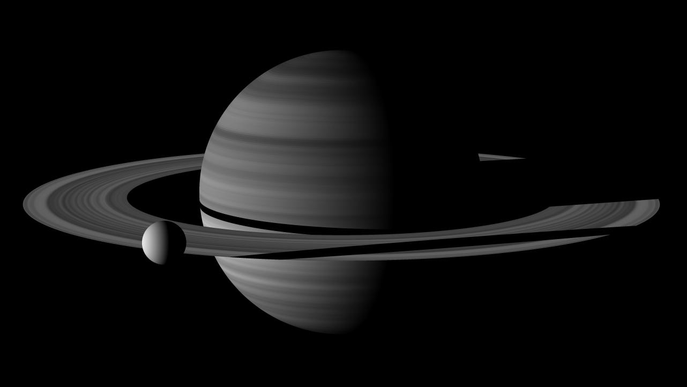

# Hello Saturn

A collection of 3D renderers written with a single purpose - to produce a real-life scene from scratch with the least amount of code in each language. The scene is based on the general look of [raw Cassini photos](https://science.nasa.gov/mission/cassini/multimedia/featured-raw-images/), with some artistic liberties (primarily the Saturn's satellite is not to scale with the planet and its rings). Common features of each implementation include lambert shading, recursive drop shadows, and procedural generation of textures.

## Wolfram Mathematica

**The** shortest raytracer. The whole code is 477 characters (line breaks added for "readability"):

```
W=320;H=180;v=.35/W;f=Norm;X={1,0,0};Z={0,0,1};L=Last;k=#/f@#&;t=Interpolation@RandomReal[1,99];
T[o_,n_,s_:1]:=(c=0;j=99;e=.05;l=X+e Z;S[u_,r_]:=(h=u-o;a=f[h\[Cross]n];
If[a<r,If[j>#>e,c=If[p=o+n#;b=p-u;T[p,l]==0,l.k@b(t[50+L@p r]+6),s];
j=#]&/@(h.n+Sqrt[r^2-a^2]{-1,1})]);S[0X,4]S[{8,6,0},.4];a=L@n;If[f@a>e,h=-L@o/a;p=o+n h;
If[j>h>e&&6<f@p<9,c=If[T[p,l]==0,t[6f@p]+2,s];j=h]];.1c);m=RotationMatrix;M=m[1,Z].m[1,X];
Image@Table[T[40M.Z,k[M.{x v,y v,-1}],0],{y,H,-H,-1},{x,-W,W}]
```

The result it produces:


Available online on [Wolfram Cloud](https://www.wolframcloud.com/obj/566c07ee-4a30-44ad-8329-c29e07d14e01)

Enabled in part by a few high-level features of the Wolfram language itself, and in part by a rather aggressive optimisation, favouring concise approximate calculations over exact but longer ones, and tailoring the renderer to the selected scene by excluding simulation of any effects not manifested at the specific positions of the objects relative to each other, the light, and the camera. A more sensible and rigorous version accompanied by some comments, is available in the project notebook.

## C++

Based on [the C++ business card raytracer](https://fabiensanglard.net/rayTracing_back_of_business_card/) (1233 characters, not counting preprocessor directives), which served as an inspiration for the whole project. The Saturn raytracer forgoes some features of the original which are not essential to the scene at hand (such as depth of field and reflections), using the saved space to add more varied geometry (rings and variable-radius spheres not bound to nodes of a flat square grid) and a different procedural texture. The result takes 1099 characters (not counting preprocessor directives and inserted line breaks):

```
#include <stdlib.h>
#include <stdio.h>
#include <math.h>
#define O operator
#define R return
typedef int i;typedef float f;struct v{f x,y,z;v O+(v r){R v(x+r.x,y+r.y,z+r.z);}v O*(f r){R v(x*r,y*r,z*r);}
f O%(v r){R x*r.x+y*r.y+z*r.z;}v(){}v O^(v r){R v(y*r.z-z*r.y,z*r.x-x*r.z,x*r.y-y*r.x);}v(f a,f b,f c){x=a;y=b;z=c;}
v O!(){R*this*(1/sqrt(*this%*this));}}; f G[][4]={{0,0,0,1},{-2,-1.5,0,.2}};f u[99];i T(v o,v d,f& t,v& n){
t=1e9;i m=0;if (abs(d.z)>.01) {f p=-o.z/d.z;v w=o+d*p;if(.01<p && 2.25<w%w && w%w<4.4) t=p,n=!v(1,0,1),m=1;}
for(i k=2;k--;){v p=o+v(G[k][0],G[k][1],G[k][2]);f b=p%d,c=p%p-G[k][3]*G[k][3],q=b*b-c;if(q>0){f s=-b-sqrt(q);
if(s<t && s>.01)t=s,n=!(p+d*t),m=2;}}R m;}f W(f H) {i j=floor(H); H=H-j;R ((1-H)*u[j]+H*u[j+1]);}f S(v o,v d){
f t;v n;i m=T(o,d,t,n);if(!m)R 0;v h=o+d*t,l=!v(1,0,.07),r=d+n*(n%d*-2);f b=l%n;if(b<0||T(h,l,t,n))b=0;
f p=.9*W(19*(h.z+2)); if(m&1){p=.5*W(24*sqrt(h%h));} R p*b;}i main(){for (i j=99;j--;) {u[j]=(.5+.5*rand()/RAND_MAX);};
printf("P6 640 360 255 ");v g=!v(-7.1,4.5,-5.4),a=!(v(0,0,1)^g),b=!(g^a);for(i y=360;y--;)for(i x=640;x--;){
f p=11;{p=S(v(7.1, -4.5, 5.4),!((a*(x-320)+b*(y-180))*.00114+g))*250+p;}printf("%c%c%c",(i)p,(i)p,(i)p);}}
```

(should be invoked with the output written to a `.ppm` file, e.g. ```hello > saturn.ppm```, where `hello` is the name for the compiled binary file)


## GLSL (shaders)

Not-as-minimal (but still rather short) real-time animated implementation. Comes with a free camera controlled with a mouse, an orbiting mode toggled by pressing `space`, antialiasing, and, for the lack thereof in the base language, a from-scratch random-number generator based on [logistic map](https://en.wikipedia.org/wiki/Logistic_map).



[The interactive version is available on Shadertoy](https://www.shadertoy.com/embed/stByRG?paused=false)

Even includes [the Satrun's hexagon](https://en.wikipedia.org/wiki/Saturn%27s_hexagon) on the north pole:


## After Effects (JS)


Not an actual raytracer, but rather an After Effects project that utilizes the built-in 3D rasterising engine (made for rendering exclusively flat square surfaces), and recreates the illusion of convex 3-dimensional objects with the help of built-in effects, generated textures, and Java Script expressions, which tie parameters of all objects to build a coherent scene and modify them based on the position of the camera:


Also imitates the polar hexagon:


but does not support drop shadows on the spheres due to technical limitations of the engine (adds semi-transparency to the rings though).

## Python

Intended mostly as a tutorial, this version has more readable code and includes detailed comments. Available online on [Google Colab](https://colab.research.google.com/drive/1PR4u2Hia5xthwy1G5SM-yVO5H_cr1HCY#scrollTo=5b39d429)
